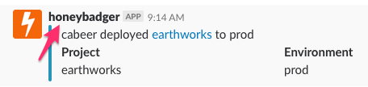
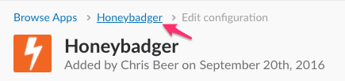

# Automating Deployment Notifications on Slack

After installing Honeybadger for monitoring, new projects should add a Slack integration that reports to the #deploy channel. **Note:** You must be an Admin on the DLSS Honeybadger team to add/edit Slack integrations.

## Key concepts
- The Slack Honeybadger app supports multiple integrations, issuing one token / Webhook URL per channel.
- One Webhook URL (e.g. the #deploy channel token) is shared among several Honeybadger projects
- A Honeybadger project can support multiple Honeybadger --> Slack integrations, and each integration can have different settings. e.g. exhibits sends prod deployment notifications to #deploy. #dlss-spotlight-dev receives notificaitons for both prod and stage deployments.

## #deploy Channel Notifications (prod only)
1. Get the current Webhook URL pinned on the #deploy channel

2. Select your project in Honeybadger and go to Settings --> Alerts & Integrations. _Note_: If "Alerts & Integrations" is not available, you do not have Honeybadger admin privileges. Request permissions on #software-developers.

3. Select Slack from the "Add a Project Integration" list

4. Copy the #deploy channel Webhook URL. Uncheck all options EXCEPT:
  - Enable Slack
  - Environment: Prod
  - Error events: When a project is deployed

5. Click "Save Changes" at the bottom of the form

## Notifications on other channels (optional)

1. Access the Slack Honeybadger app by clicking on a notification in the #deploy channel. Click on "Settings", then select "Honeybadger" from the breadrumbs.

2. Check our current list of Honeybadger --> Slack integrations.
 Is there an existing integration for the channel you want to post to?
  - YES: copy the Webhook URL and #deploy channel instructions from Step 2 onwards
  - NO: Click "Add Configuration"

3. Select channel, click "Add Honeybadger Integration" and add a Descriptive Label. Copy Webhook URL and save the integration.

4. Follow #deploy channel instructions from Step 2 onwards and configure to your heart's content.
