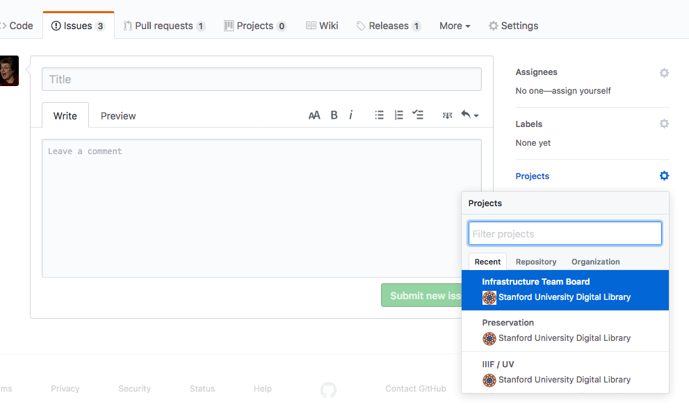

# Guide for Infrastructure Team First Responder

The DLSS Infrastructure team is using a rotating role of "first responder." This doc explains the concept of the first responder role and outlines specific duties and expectations.

## Table of Contents

* ["First Responder" Rotation Premises](#first-responder-rotation-premises)
  * ["First responder" != "on call"](#first-responder--on-call)
* [Duties](#duties)
  * [Weekly Dependency Updates](#weekly-dependency-updates)
    * [Ensure dependency update spreadsheet is created](#ensure-dependency-update-spreadsheet-is-created)
    * [Ensure Monday dependency updates are completed](#ensure-monday-dependency-updates-are-completed)
      * [Code that isn't a Ruby Application or Gem](#code-that-isnt-a-ruby-application-or-gem)
  * [Verify / Notify Coverage for Following Week](#verify--notify-coverage-for-following-week)
  * [Sign Up for Your Next First Responder Shift](#sign-up-for-your-next-first-responder-shift)
  * [Run infrastructure-integration-tests](#run-infrastructure-integration-tests )
  * [Proactively Check for Production Problems](#proactively-check-for-production-problems)
  * [Triage Production Problems](#triage-production-problems)
  * [Improve Troubleshooting Documentation as Needed](#Improve-Troubleshooting-Documentation-as-Needed)
  * [Improve First Responder Instructions as Needed](#improve-first-responder-instructions-as-needed)
  * [Other Duties as Assigned](#other-duties-as-assigned)
* [How to Proactively Check for Production Problems](#how-to-proactively-check-for-production-problems)
* [How to Triage Production Problems](#how-to-triage-production-problems)
  * [A note on prioritization](#a-note-on-prioritization)
* [What if first responder isn't available?](#what-if-first-responder-isnt-available)

## "First Responder" Rotation Premises

* Respond to production issues in a timely fashion during business hours.
* Single process for handling questions outside the team's current work cycle.
* Share the responsibility for production outages across the team in a planned way.
* Every team member rotates through this responsibility.
* Encourage cross-training, since a first-responder will likely have to investigate applications with which they are unfamiliar.
* Shore up missing and outdated documentation of production code and processes for everyone (ops, devops, PSM, stakeholders, devs, etc), informed by actual attempts to find and use said documentation to investigate production issues.

### "First Responder" != "On Call"

The idiosyncratic name of the role is intentional. It is not the duty of the first responder to be on-call outside of the first responder's normal work hours (which may not line up exactly with business hours in Palo Alto). The first responder rotation is an effort to watch and triage production issues in an intentional and organized fashion, since no engineer was officially assigned this responsibility in the past, and such minding of things was haphazard.

## Duties

### Weekly Dependency Updates

#### Create dependency update spreadsheet

Instructions are here https://docs.google.com/spreadsheets/d/1LysSAPFsRGt9PteWpVswp74xnPXyLLxADpHRfh69VLQ/edit#gid=0

This is how we track dependency updates over time.

#### Complete Monday dependency updates

The first responder needs to make sure that all codebases needing updates have updates merged and deployed. Note that some projects may need to have PRs created by hand where automatic creation may have failed. It is helpful to post updates in the `#dlss-infrastructure` Slack channel to make sure the team is aware of this work, in case anyone is working in related codebases or looking to deploy changes.

##### Merge 'em

Run the `merge-all` script to automatically merge all dependency update PRs: https://github.com/sul-dlss/access-update-scripts/blob/master/merge-all.rb. Note that this script will only work with Ruby 2.6 or greater.  See the comments at the top for how to run and note you will need a github access token if you haven't previously created one.  Instructions for creating a token are here:  https://help.github.com/en/github/authenticating-to-github/creating-a-personal-access-token-for-the-command-line   Save your token somewhere secure for re-use since you won't be able to view it in the Github interface again.

##### Deploy 'em

Use the `sdr-deploy` script to deploy all infrastructure projects (with exceptions noted below) via capistrano to deployed environments: https://github.com/sul-dlss/sdr-deploy

**NOTE**: There are applications that need to be deployed separately (i.e., not using `sdr-deploy`), currently (as of August 2020): sinopia apps, dlme-transform, and rialto-webapp are deployed using Terraform. Also note `sdr-deploy` is not a good tool for deploying the hydra_etd application to the `uat` environment nor for deploying the sul-pub application to its environments beyond `stage` and `prod`: https://github.com/sul-dlss/sul_pub/tree/master/config/deploy. And these need to be done every week.

Note that you will need to be sure you can ssh into each of the VMs from wherever you are running the deploy script.

- qa: deploy to qa with script
- stage: please run infrastructure-integration-tests before deploy to stage, then deploy to stage with script, then run tests after deploy to stage.
    - take note in #dlss-infra-stage-use if there is active testing going on;  be sure to either comment out that app or coordinate with tester
- prod: if all tests passed for stage deploys, deploy to prod with script.

##### Code that isn't a Ruby Application

We have codebases that aren't Ruby applications or gems. We have not yet settled on a long-term method for dealing with these:

- java code
  - the Infrastructure team is down to one Java repository in our platform, [etdpdf](https://github.com/sul-dlss/etdpdf), and it does not go through CI or receive maintenance updates
- Go projects (such as various RIALTO components)
  - with the future of RIALTO in question, it's not likely to receive attention any time soon

Note that security updates affecting our Ruby **gems** will be caught when doing capistrano deployments via `gemfile audit`.

### Verify / Notify Coverage for Following Week

1. Verify first responder for following week is still able to cover it. Check this with on deck person on Monday (and keep in mind throughout the week, e.g., if person becomes ill).  (schedule: https://docs.google.com/spreadsheets/u/1/d/13TJR93Yc9_eF5B7w4XDx6ggG_wb3aLkgCHjpLwmHPBA/)
  1. It's the scheduled responder's responsibility to find a swap, not current first responder.
  1. The person covering the following week is "on deck" for this week.
1. Set Slack reminders in `#dlss-infrastructure` for next week's Monday morning. The reminders should indicate who is first responder and who is on deck for that week, and should be set for 3 am Pacific time/6 am Eastern, so that the east coast early risers don't have to wait for it.
  * Documentation on Slack's `/remind` command:  https://get.slack.help/hc/en-us/articles/208423427-Set-a-reminder
    * E.g., if Alice and Bob are up next week, `/remind #dlss-infrastructure Monday at 3 am "@alice is the first responder week of Monthuary 8, and @bob is on deck"`

### Sign Up for Your Next First Responder Shift

The infrastructure team has 8 developers, so you should be taking a shift every 8 or so weeks.
* Schedule:  https://docs.google.com/spreadsheets/u/1/d/13TJR93Yc9_eF5B7w4XDx6ggG_wb3aLkgCHjpLwmHPBA/

### Run infrastructure-integration-tests

We want the FR to be sure this test suite remains useful by running all the tests.

This should be done as part of running autodeploy of dep updates to stage (e.g.:  run tests before deploy to stage, then deploy to stage, then run tests after deploy to stage)

If some tests fail when running the whole test suite at once, but pass when run individually, that is ok -- as long as they all pass under some circumstances.

### Proactively Check for Production Problems

See [How to Proactively Check for Production Problems](#how-to-proactively-check-for-production-problems) section below for specifics.

### Triage Production Problems

If a user reports a problem, or if one is surfaced from monitoring, the first responder ought to timebox an investigation of the problem (_TBD: 30 min?_). See [How to Triage Production Problems](#how-to-triage-production-problems) section below for more specifics.

### Improve Troubleshooting Documentation as Needed

If you need to triage or troubleshoot a problem and realize some documentation is missing, please provide it. List of appropriate places:
* https://github.com/sul-dlss/DevOpsDocs - e.g., what an ops or devops person would need to know to handle the situation
* README or other top level markdown doc in codebase (viewable via github)
  * Which codebase would need to be apparent from the problem
* Wiki for the codebase
* ? - in general, consider where the person interested in the info might look first. An end-user might go to the wiki, a dev might go to the README, ops folks might head to DevOpsDocs. Use your best judgement and ask for feedback if unsure.

The above documents should be useful and current. Please submit improvements as PRs for review.

If for some reason documentation is a significant undertaking, the call for documentation can be filed as an issue and prioritized/resourced by management.

### Improve First Responder Instructions as Needed

We need this document to be useful and current.  Please submit improvements as PRs for review.

### Other Duties as Assigned

* Management may choose to have the first responder handle a non-project work ticket
  * If so, ensure you assign the ticket to yourself and put it in the "in progress" column the project board https://github.com/orgs/sul-dlss/projects/1
* First responder may be asked to spearhead a work estimate https://github.com/sul-dlss-labs/estimation (note that these are, by definition, meant to be done by more than one person; if it's smaller, should it be a ticket in a project?)

## How to Proactively Check for Production Problems

At the very least, the first responder should be watching:

* [Honeybadger alerts](https://app.honeybadger.io/projects) for projects in the Infrastructure portfolio
  * **Note** that you may want to resolve old alerts in the Honeybadger UI at the beginning of your first responder shift so you have a clean slate to monitor.
* Feedback email lists, e.g. argo-feedback, sinopia-feedback, etc
* Slack channels relevant to applications in the portfolio:
  - `#dlme` - "Digital Library of the Middle East" - we are responsible for dlme-transform, related to indexing of materials.
  - `#dlss-aaas` - "Accessioning as a Service" - where accessioneers may surface problems
  - `#dlss-argo-dev`- where accessioneers and object editors may surface problems
  - `#dlss-etds-dev` - Electronic Theses and Dissertations channel
  - `#dlss-infrastructure` <-- our team's main channel
  - `#dlss-preservation-dev`
  - `#dlss-sinopia-dev` - Sinopia is our linked data channel
  - `#earthworks` - for gis-robot-suite related discussion
  - `#pre-assembly` - where accessioneers may surface problems with pre-assembly
  - `#sdr-operations`
  - `#sul-cap-collab` - has developers in the School of Medicine working on the Profiles project (which we connect to with our sul-pub system)
  - `#web-archiving`
* Queue dashboards:
  - robots
    - https://robot-console-prod.stanford.edu/overview
      - https://robot-console-prod.stanford.edu/failed
    - https://argo.stanford.edu/report/workflow_grid
  - pre-assembly
    - https://sul-preassembly-prod.stanford.edu/resque/overview
  - preservation
    - https://preservation-catalog-prod-01.stanford.edu/resque/overview
      - https://preservation-catalog-prod-01.stanford.edu/resque/failed
  - web-registrar-app
    - https://was-registrar-app.stanford.edu/queues
  - dor-services-app sidekiq (for jobs run by workers in other threads):
    - https://dor-services-prod.stanford.edu/queues/
  - google books
    - https://sul-gbooks-prod.stanford.edu/queues
  - sdr-api
    - https://sdr-api-prod.stanford.edu/queues
  - techmd service
    - https://dor-techmd-prod.stanford.edu/queues
* cron daemon emails
* GitHub security alerts

As a loose guideline, we recommend checking each of these at least once or twice a day to stay on top of potential issues.

Other places to monitor:
* Nagios alerts (https://sul-nagios-prod.stanford.edu/nagios/  The Services tab on the left column will give overview of checks.  The Problems->Services tab will give you what’s alerting.)
* Grafana at https://sulstats.stanford.edu/ gives different visualizations of running
infrastructure servers with the option to create customized dashboards.
* If you hear about possible security issues through other avenues (e.g. `#iso-public` on Slack, your consumption of the news in general), and you feel that the issues may be relevant and uncaptured, file an issue and call attention to it as needed.

## How to Triage Production Problems

If a user reports a problem, or if one is surfaced from monitoring, the first responder is meant to timebox an investigation of the problem (_TBD: no more than 30 min?_). It's fine to ask teammates with relevant expertise for help, but also think about what documentation is needed so the next person will need less help. It is _not_ the job of the first responder to fix the issue on the spot (though if the fix is trivial, it's fine to do so).

* All problems investigated should get a ticket UNLESS:
  * Investigation leads to discovery that there is no problem
    * If additional documentation would have made this clearer, then
      * First responder creates additional documentation (preferred) or a ticket for it
  * Fixing the problem will be as quick as writing up a ticket
    * First responder fixes the problem in this case.
* All new tickets should be added to the infrastructure team's [general project board](https://github.com/orgs/sul-dlss/projects/1) (select project board from "projects" when on issue page)

### A note on prioritization

Prioritization is the responsibility of management, not the responsibility of the first responder. Though of course, if a developer becomes aware of what may be a high priority issue, and is unsure whether management is aware of the issue (or sufficiently aware of its severity), the developer is certainly encouraged to bring the issue to their manager's attention.

* Types of data to help with prioritization
  * Is this a significant production problem? A non-critical outage?
  * Is there a workaround?  If so, how onerous is it?  How adequately does it cover the unavailable or misbehaving functionality?
  * Does it affect lots of end-users?  A handful of super-users?
  * How many digital resources are affected?
  * Is it blocking time sensitive work?

## What if first responder isn't available?

The idea is for the first responder to be "interruptible" for production problems during his/her week of coverage.  If there are significant blocks of time when this isn't true (e.g. ½ day meeting with no access to slack or email), or if life happens (illness, family emergency, etc.), hopefully the first responder can arrange for coverage.  ("I'll take one of your days if you can cover Tues for me").  Please notify `#dlss-infrastructure` Slack channel of changes.

When the first responder can't arrange for coverage, the default would be for the "on deck" responder to become first responder. The "on deck" person is the first responder for the following week.
